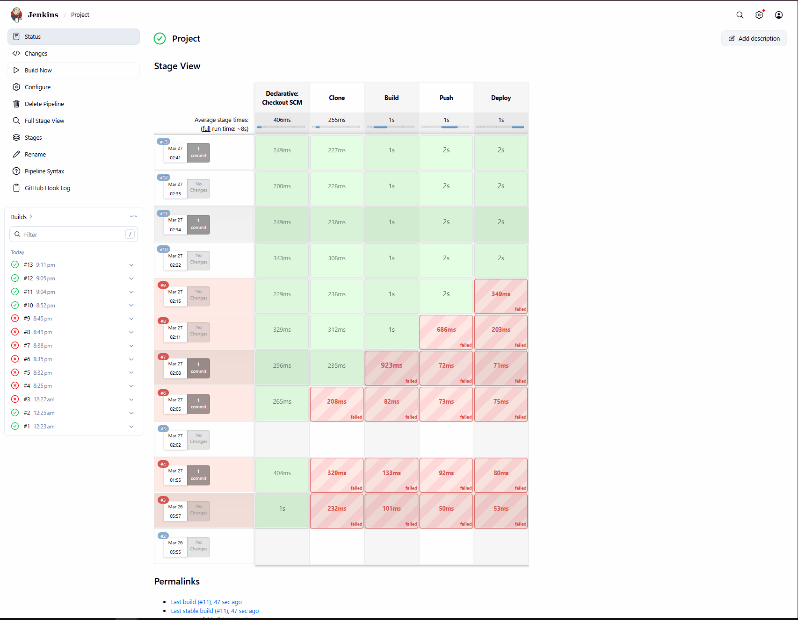
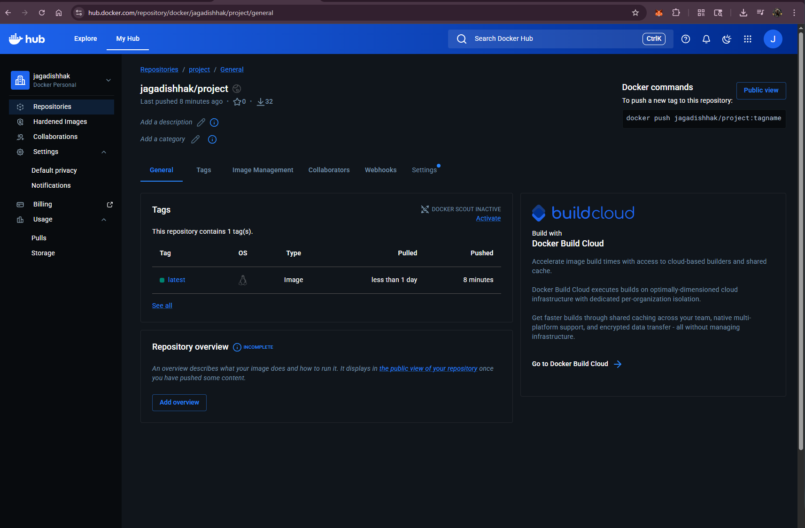
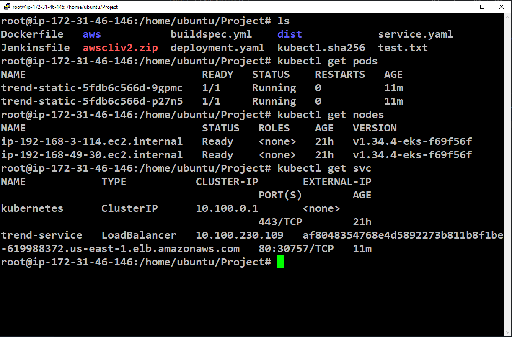
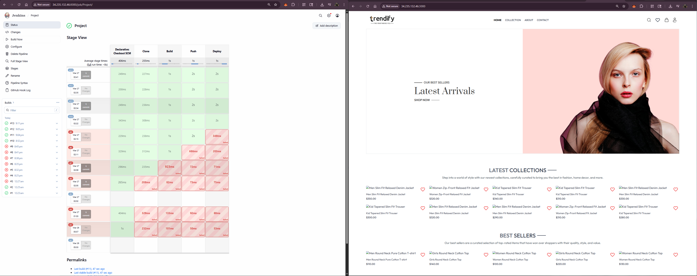

# 🚀 DevOps CI/CD Pipeline with Jenkins, Docker & AWS EKS

---

## 📌 Project Description

This project demonstrates an end-to-end **CI/CD pipeline** to build, push, and deploy a containerized static web application to **Amazon EKS (Kubernetes)** using Jenkins automation.

---

## 🧰 Tech Stack

* Jenkins
* Docker
* DockerHub
* Amazon EKS
* Kubernetes (kubectl)
* AWS EC2
* GitHub

---

## 🔄 CI/CD Pipeline Flow

### 🔹 Source Stage

* Code fetched from GitHub repository

### 🔹 Build Stage (Jenkins)

* Build Docker image from application
* Use Nginx to serve static files

### 🔹 Push Stage

* Authenticate with DockerHub
* Push Docker image to registry

### 🔹 Deploy Stage

* Connect to EKS cluster
* Deploy using Kubernetes YAML files

---

## 🏗️ Architecture

```
GitHub → Jenkins → Docker → DockerHub → EKS → LoadBalancer → Browser
```

---

## ⚙️ Setup Instructions

### 1️⃣ Create EKS Cluster

```bash
eksctl create cluster --name Project --region us-east-1
```

### 2️⃣ Configure kubectl

```bash
aws eks update-kubeconfig --region us-east-1 --name Project
```

### 3️⃣ Build & Push Docker Image

```bash
docker build -t <dockerhub-username>/project .
docker push <dockerhub-username>/project
```

### 4️⃣ Deploy to Kubernetes

```bash
kubectl apply -f deployment.yaml
kubectl apply -f service.yaml
```

### 5️⃣ Run Jenkins Pipeline

* Configure Jenkins with GitHub webhook
* Trigger pipeline on every commit

---

## 📦 Deployment Files

### 🔹 deployment.yaml

* Creates Kubernetes deployment
* Defines container, replicas, and ports

### 🔹 service.yaml

* Exposes application via LoadBalancer
* Routes traffic to pods

---

## 🌐 Application Access

Get LoadBalancer URL:

```bash
kubectl get svc
```

Open in browser:

```
http://af8048354768e4d5892273b811b8f1be-619988372.us-east-1.elb.amazonaws.com
```

---

## 📸 Screenshots

### ✅ Jenkins Pipeline Success



---

### ✅ DockerHub Image



---

### ✅ Kubernetes Pods

```bash
kubectl get pods
```


---

### ✅ Kubernetes Services

```bash
kubectl get svc
```



---

### ✅ Application Running



---

## ❗ Challenges Faced

* GitHub webhook not triggering Jenkins
* Branch mismatch (main vs master)
* Docker permission denied error
* DockerHub authentication failure
* Kubernetes authentication issue
* LoadBalancer not accessible
* Static images not loading (Vite base path issue)

---

## 💡 Key Learnings

* CI/CD pipeline automation using Jenkins
* Docker image creation and registry usage
* Kubernetes deployment on AWS EKS
* Troubleshooting real-world DevOps issues
* Networking and LoadBalancer configuration

---

## 💰 Cleanup

```bash
eksctl delete cluster --name Project --region us-east-1
```

---

## 👨‍💻 Author

**Jagadish V**
DevOps Engineer (Fresher)
Chennai, India 🇮🇳

---
